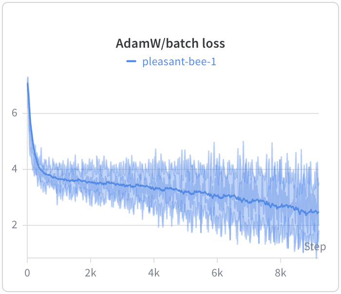
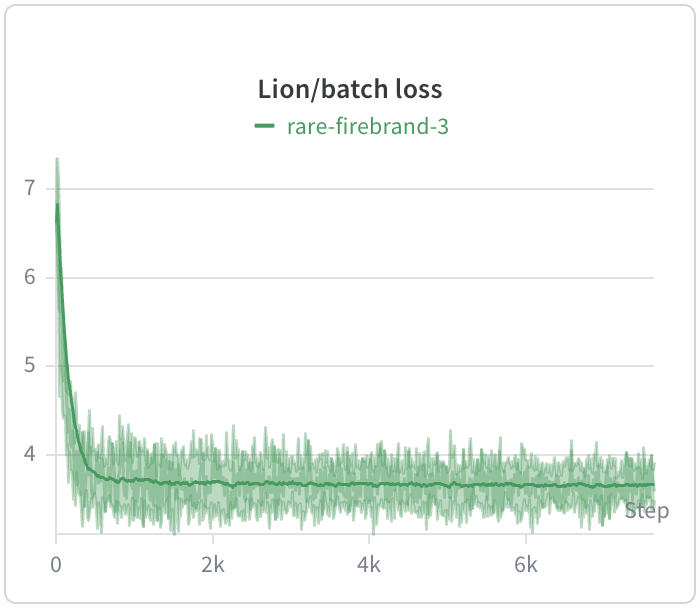

# ViT with PyTorch
## Research task
Comparison of AdamW and Lion optimizers on Oxford-IIIT Pet dataset: [pdf report](./vit_otchet.pdf)

  <table>
    <tr>
      <td></td>
      <td></td>
    </tr>
  </table>

